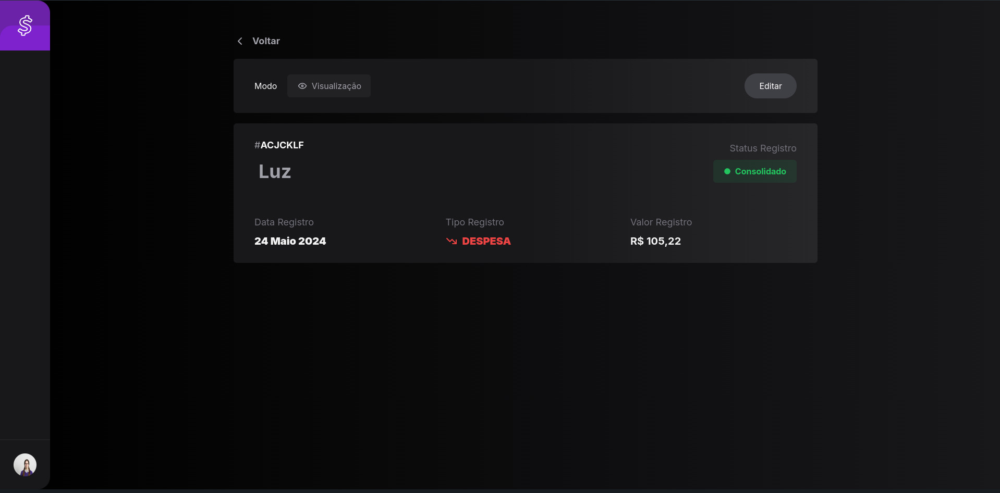

> [Clique aqui para acessar o vídeo de apresentação do projeto](https://www.youtube.com/watch?v=u0NETQE8DmY)

## Etapa 1 - Manipulação Registros

> Dica: Desenvolva essa etapa executando o código diretamente pelo terminal, sem interface gráfica.

### Requisitos Funcionais

- Um usuário deve conseguir cadastrar um novo registro, com as seguintes propriedades:
  - Descrição
  - Data do registro
  - Tipo do registro (que pode assumir apenas os valores despesa ou receita)
  - Valor do registro
  - Status do registro (que pode ser pendente, consolidado, ou cancelado)
  - Id (deve ser gerado automaticamente)
- Um usuário deve conseguir editar um registro já inserido podendo alterar a descrição, data, tipo, valor e status do registro
- Um usuário deve conseguir excluir um registro já existente
- Um usuário deve conseguir filtrar seus registros por status, podendo escolher entre consolodidados, pendentes, cancelados ou todos.

## Etapa 2 - Interface

### Requisitos funcionais

- Ao entrar na aplicação o usuário deve ver todos seus registros com as inforamções de id, data, descrição, tipo, valor e status.
- Na tela inicial deve ser possível selecionar um filtro para os registros
- Ao clicar em um registro deve ser possível editá-lo
- Um usuário deve poder cancelar a edição de um registro
- O usuário deve poder criar um novo registro através de um botão
- Um usuário deve poder cancelar a criação de um novo registro
- O usuário deve poder excluir um registro

### Imagens de Referência

## Funcionalidades Extras [opicional]

- Implementar o fluxo de autenticação
- Agrupar os registros por mês
- Exibir resumo do mês com o total de receitas e despesas daquele mês

## Materiais de apoio sugeridos

### Cursos da Formação sugeridos:

> Obs: Não é necessário ter feito todos os cursos para participar do projeto, mas se houverem dúvidas, esses cursos são um bom ponto de consulta.

- Fundamentos.DEV > Trilha Git e GitHub > Git e Github Básico
- Fundamentos.DEV > Trilha Git e GitHub > Git e Github Branches
- Especialista.DEV > Trilha React&Next > Fundamentos de React
- Especialista.DEV > Trilha React&Next > React com Tailwind CSS
- Especialista.DEV > Trilha React&Next > Next.JS
- Especialista.DEV > Trilha Banco de Dados > Banco Relacional
- Especialista.DEV > Trilha Banco de Dados > SQL
- Especialista.DEV > Trilha Backend > API com Express JS
- Especialista.DEV > Trilha Backend > Persistência com Knex.js

### Outros conteúdos sugeridos:

#### Youtube da Cod3r

- [Conceitos Essenciais: O Básico de HTTP](https://www.youtube.com/watch?v=CXzbUwK6lc8)
- [Backend limpo](https://www.youtube.com/watch?v=5p5sE62bBVs)

#### Blog da Formação

- [Aprendendo a lidar com erros](https://blog.formacao.dev/aprendendo-a-lidar-com-erros/)
- [Instalando o PostgreSQL no Windows](https://blog.formacao.dev/instalando-o-postgresql-no-windows/)
- [Como armazenar senhas de usuários](https://blog.formacao.dev/como-armazenar-senhas-de-usuarios/)
- [Github Desktop](https://blog.formacao.dev/github-desktop/)
- [O que é o arquivo .gitignore](https://blog.formacao.dev/o-que-e-o-arquivo-gitignore/)
- [Validações com o pacote validator](https://blog.formacao.dev/validacoes-com-o-pacote-validator/)

### Referências

- A interface desse projeto foi implementada a partir de um projeto deo [Frontend Mentor](https://www.frontendmentor.io)
